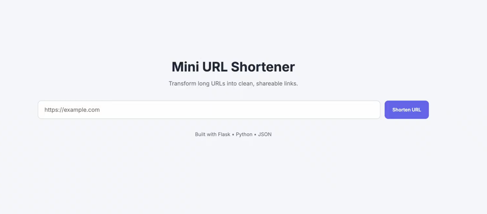
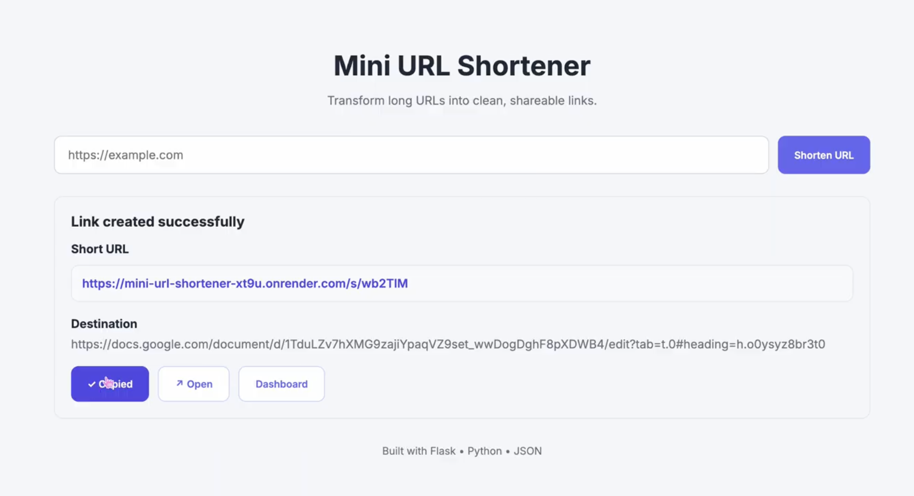
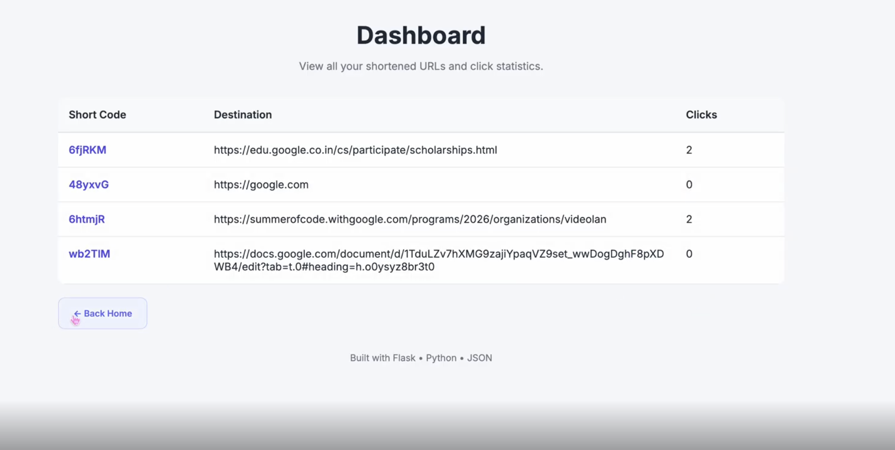

# Mini URL Shortener

A simple Flask-based URL shortener that generates unique 6-character short links, stores them in a JSON file, tracks click counts, and redirects users to the original URL.

---

## Live Demo

**Render Deployment:**  
https://mini-url-shortener-xt9u.onrender.com/

> **Note**
> - The application is hosted on Render's free tier. The first request may take a few seconds if the service is waking up.
> - This project stores data in a local JSON file as required by the assignment. Since Render's filesystem is ephemeral, shortened URLs may reset after the service restarts or is redeployed.

---

## Features

- Generate unique 6-character alphanumeric short URLs
- Redirect users to the original URL
- Store URL mappings in a JSON file
- Track the number of clicks for every shortened URL
- Dashboard to view all shortened URLs and click statistics
- URL validation
- Custom 404 page for invalid short links
- Responsive and clean user interface
- Copy shortened URL to clipboard

---

## Project Structure

```
mini-url-shortener/
│
├── app.py
├── links.json
├── requirements.txt
├── Procfile
├── README.md
│
├── static/
│   ├── style.css
│   └── script.js
│
└── templates/
    ├── index.html
    ├── dashboard.html
    └── 404.html
```

---

## Installation

1. Clone the repository

```bash
git clone https://github.com/mahek888/mini-url-shortener
```

2. Navigate to the project directory

```bash
cd mini-url-shortener
```

3. Install dependencies

```bash
pip install -r requirements.txt
```

4. Run the application

```bash
python app.py
```

5. Open your browser and visit

```
http://127.0.0.1:5000
```

---

6. Screenshots







---

## How It Works

1. Enter a valid URL. [ should have http:// or https:// ]
2. Click **Shorten URL**.
3. A unique 6-character code is generated.
4. The URL mapping is stored in `links.json`.
5. A shortened URL is displayed.
6. Visiting the shortened URL redirects to the original website.
7. Every redirect increments the click count.
8. The Dashboard displays all shortened URLs and their statistics.
